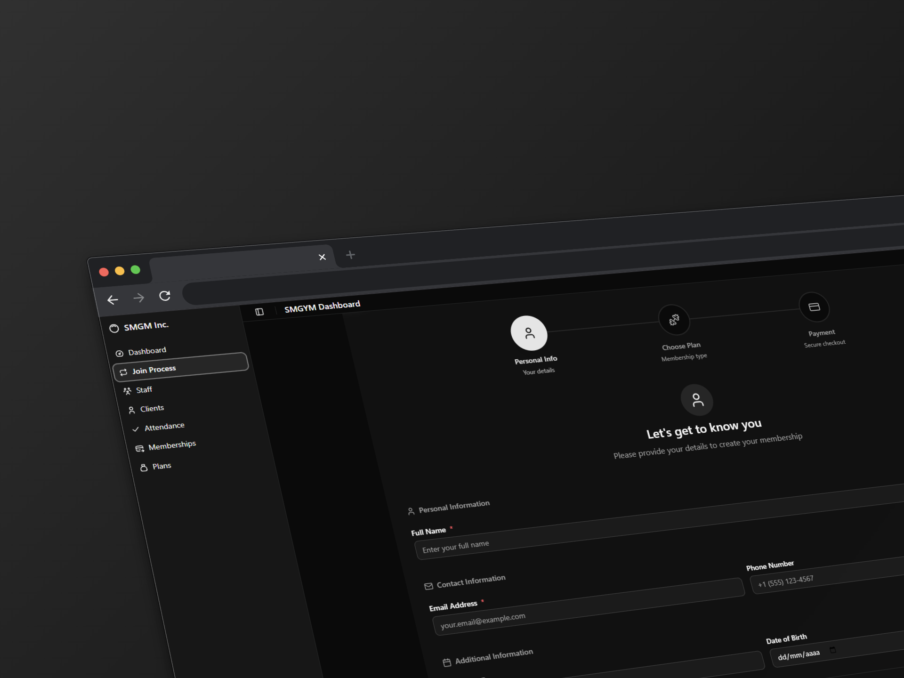
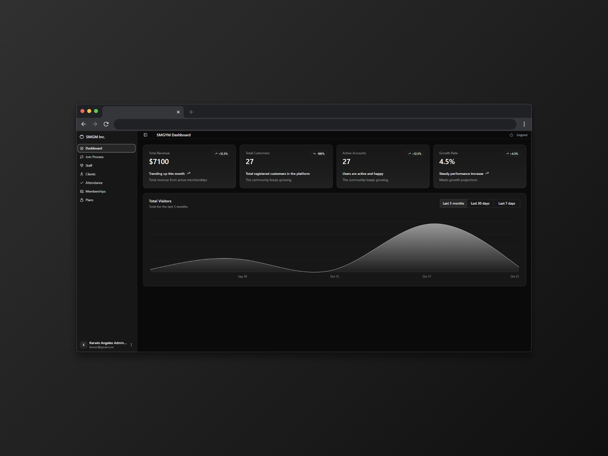

# SMGYM

Sistema de gestión para gimnasios desarrollado con React y TypeScript. Permite administrar miembros, planes de membresía, asistencia, personal y generar reportes desde un dashboard intuitivo.

## Características Principales

- **Gestión de Clientes**: Registro, edición y administración de miembros del gimnasio
- **Planes y Membresías**: Creación y renovación de planes de membresía
- **Control de Asistencia**: Registro de check-in y estadísticas de asistencia
- **Gestión de Personal**: Administración del equipo de trabajo
- **Dashboard**: Vista general con estadísticas y métricas clave
- **Autenticación**: Sistema de login y registro con protección de rutas

  
  
  

